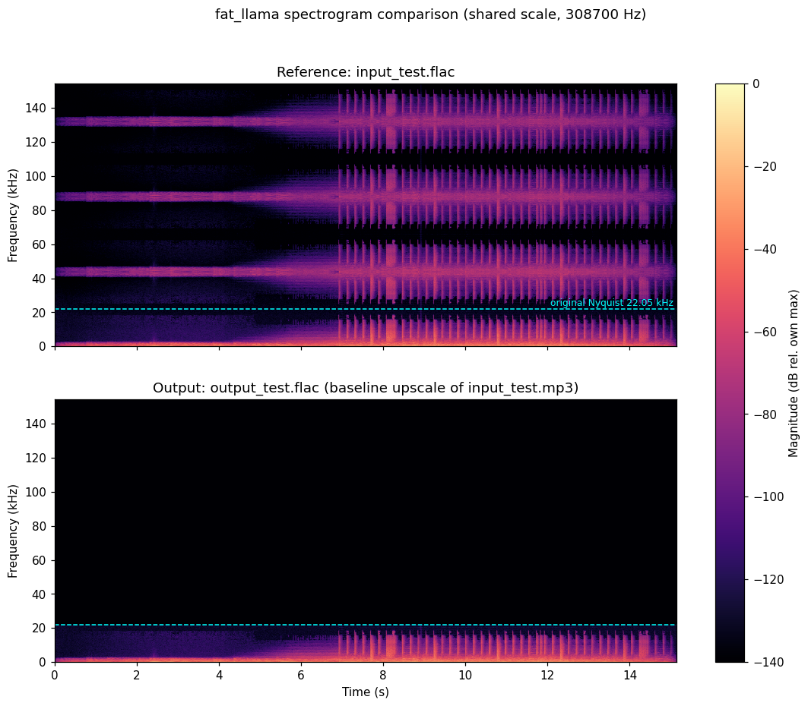

# Fat Llama   
fat_llama is a Python package for upscaling audio files to FLAC or WAV formats using advanced audio processing techniques. It utilizes CUDA-accelerated calculations to enhance audio quality by upsampling and adding missing frequencies through FFT (Fast Fourier Transform), resulting in richer and more detailed audio.

## Features

- Upscale MP3 files to high-quality FLAC format.
- Iterative soft thresholding (IST) for enhanced audio processing.
- Auto-scaling amplitude adjustment and normalization.
- Supports GPU-accelerated processing with CuPy.

## Requirements

- CUDA capable GPU

**(Note: For cpu verison please look at https://pypi.org/project/fat-llama-fftw/)**

## Installation

Install via pip:
```
pip install fat-llama
```
Note: This version works with CUDA 13 (tested against 13.3).

Further need CUDA & CuPy properly installed: https://docs.cupy.dev/en/stable/install.html

Also, requires ffmpeg: https://support.audacityteam.org/basics/installing-ffmpeg

**Note to install on older versions of CUDA and CuPy. You will need to download specific versions and install locally.**

- cupy version - https://github.com/bkraad47/fat_llama/tree/v-0.1.3---cupy
- cupy-cuda11x version - https://github.com/bkraad47/fat_llama/tree/v-0.1.3---cupy-cuda11x

To install locally:
```
git clone <target_url>
cd fat_llama
pip install .
```

## Usage

### Example Usage

You can run the example provided in example.py:

```
from fat_llama.audio_fattener.feed import upscale

# Example call to the method
upscale(
    input_file_path='input_test.mp3',
    output_file_path='output_test.flac',
    source_format='mp3',
    target_format='flac',
    max_iterations=300,
    threshold_value=0.6,
    target_bitrate_kbps=1400,
    toggle_normalize=True,
    toggle_autoscale=True,
    toggle_adaptive_filter=True
)
```
### Function Parameters

- `input_file_path (str)`: Path to the input audio file. Mandatory.
- `output_file_path (str)`: Path to the output processed audio file. Mandatory.
- `source_format (str)`: Format of the input audio file (e.g., 'mp3', 'wav', 'ogg', 'flac').
- `target_format (str)`: Format of the output audio file (e.g., 'flac', 'wav'). Default is 'flac'.
- `max_iterations (int)`: Maximum number of iterations for IST. Default is 800.
- `threshold_value (float)`: Threshold value for IST. Default is 0.6.
- `target_bitrate_kbps (int)`: Target bitrate in kbps. Default is 1411.
- `toggle_normalize (bool)`: Whether to normalize the audio. Default True.
- `toggle_autoscale (bool)`: Whether to autoscale the audio based on the original audio. Default True.

## Running the Example

To run the example, execute the following command:
```
python example.py
```
This will upscale the MP3 file specified in the example and produce a FLAC file with full processing.

## Spectrogram Results



<!-- AUDIO_QUALITY_SCORES:START -->
## Audio Quality Scores

Generated by the `test-fat-llama` skill's `audio-quality-checker` subagent — updated each run, not hand-edited.

| Metric | Score | Notes |
|---|---|---|
| Coherence (upscale quality, 0-10) | 9 | Every hygiene check clean (0 NaN/Inf, clipping fraction 5.14e-05 below the reference's own 1.69e-04, 0 unmatched dropouts >50ms, discontinuity p99.9 0.0165 vs reference 0.0582), and the new unconditional Nyquist-cutoff stage puts the above-22.05kHz band at -175 dB peak relative to in-band peak — essentially the FFT noise floor, satisfying the project's "no content above the original Nyquist" requirement outright. Held below 10 because the measurable change in the top octaves is proportional emphasis of already-present high-frequency content (envelope correlation 0.9945 with the reference) rather than genuinely new detail in previously-missing bands. |
| Spectral deviation vs. reference FLAC (0-10) | 9.0 | convergence=0.8166, correlation=0.9830 against input_test.flac; the two metrics disagree because correlation sees near-identical in-band time-frequency structure while the Frobenius residual is dominated by the reference's own legacy zero-order-hold mirror images (~44.1/88.2/132.3 kHz) that the new bandlimited output correctly lacks — input_test.flac is itself a legacy pipeline output, an artifact-bearing reference that caps the achievable convergence. |
<!-- AUDIO_QUALITY_SCORES:END -->

## How it works


## Algorithm Explanation

The upscaling process involves several steps:

1. **Reading Audio File**: The audio file is read, and the audio samples are extracted along with the sample rate and bitrate.
2. **Calculating Upscale Factor**: The upscale factor is calculated to achieve the target bitrate.
3. **Upscaling Channels**: The audio channels are upscaled using a bandlimited FFT-domain interpolation (zero-padding the spectrum then inverse-transforming) rather than naive sample repetition, so the extra samples don't introduce spectral imaging above the original signal's Nyquist frequency.
4. **Iterative Soft Thresholding (IST)**: IST is applied to enhance the audio by adding missing frequencies. This process uses FFT to transform the signal into the frequency domain, apply a threshold to keep significant frequencies, and then inverse transform back to the time domain, adding a harmonic-reconstruction term scaled to the signal's own amplitude each iteration.
5. **Scaling Amplitude**: The amplitude of the upscaled audio is scaled to match the original.
6. **Normalizing Audio**: The audio is normalized to the range -1 to 1.
7. **Adaptive Filtering**: An LMS adaptive filter with a short decorrelation delay refines the normalized signal, adapting its coefficients based on the signal's own short-term predictability.
8. **Original-Nyquist Cutoff**: An unconditional final FFT-domain lowpass removes any spectral content above the original source file's Nyquist frequency, guaranteeing the upscale never synthesizes or leaves behind content beyond the original recording's real bandwidth — upscaling improves precision and headroom within that bandwidth, it does not extend it.
9. **Writing FLAC File**: The processed audio is written to a FLAC file.

## Why FFT and IST?

FFT (Fast Fourier Transform) is used to transform the audio signal into the frequency domain. This allows for the identification and manipulation of specific frequency components. By applying a threshold in the frequency domain, we can keep significant frequencies and discard noise and add it to our upscaling data to add detail to upscaling frequencies.

The report titled "Fast Sparse Fourier Transformations for NMR Spectroscopy" by Badruddin Kamal, supervised by Thomas Huber and Alastair Rendall, 2015, provides a comprehensive understanding of sparse representations and their applications in signal processing. IST leverages the concepts from this report to add missing frequencies and enhance the audio quality by making it more detailed and rich. This is particularly useful in upscaling audio where some frequencies might be missing or congested.

### Test Audio Source

ericzo - beyond link(https://soundcloud.com/ericzomusic/free-electro-trap-anthem-beyond)

## Changelog

All notable changes to this project will be documented in this file.

### [1.1.0] - 2024-08-01

#### Chanaged

- Moved adaptive filtering to after normalization and auto-scaling steps.
- Reduced step size for LMS adaptive filter for improved stability.
- Ensured all processing uses CuPy for GPU acceleration.
- Added detailed comments and logging for better traceability.

### [1.0.2] - 2024-07-26

#### Changed

- Remove `logging` from requirements to fix pip bug.

### [1.0.1] - 2024-07-26

#### Changed

- Updated `analytics.py` analysis and spectorgram results.
- Updated `README.md` details.

### [1.0.0] - 2024-07-25

#### Added

- Added support for reading 'ogg', 'flac', and 'wav' file formats and calculating their bitrates correctly.

#### Changed

- Renamed `upscale_mp3_to_flac` method to `upscale` to support multiple source formats.
- Simplified the workflow to focus on 'mp3' to 'flac' conversion with essential steps only.

#### Removed

- Dropped support for 'ape' and 'alac' target formats.

### [0.1.8] - 2024-07-24

#### Added

- Introduced toggle flags for normalization, equalization, amplitude scaling, and gain reduction.
- Enhanced auto-scaling of amplitude based on the original MP3 file when `toggle_scale_amplitude` is `False`.
- Logging for each step of the processing to provide better traceability and debugging.

#### Changed

- Default values for parameters are now set at the function call.
- Refined the upscaling algorithm to ensure better handling of amplitude and gain.
- Renamed the flags for consistency (`toggle_wiener_filter`, `toggle_normalize`, `toggle_equalize`, `toggle_scale_amplitude`, `toggle_gain_reduction`).

#### Fixed

- Fixed issues related to numpy and cupy array conversions.
- Improved error handling for invalid target bitrate values.
- Addressed the issue where the amplitude of the produced signal was significantly weaker than the original.

### [0.1.7] - 2024-07-22

#### Added

- Added methods for MP3 to FLAC conversion with optional processing using CuPy for GPU acceleration.
- Initial version of `upscale_mp3_to_flac` method with parameters for iterative soft thresholding (IST), gain reduction, and equalization.

### [0.1.0] to [0.1.6] - 2024-07-20

#### Added

- Basic functionality for reading MP3 files and writing FLAC files.
- Initial implementation of the new interpolation algorithm and IST for audio processing.